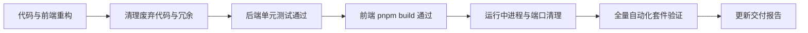

# AGENTS.md - AI Agent 协作准则与工程质量规范

本文件是所有在此代码仓库（MQTT Broker）中工作的 AI Agent 与研发人员的**最高协作准则与工程规范**。任何在本项目中执行需求开发、架构演进、代码重构或缺陷修复的 Agent，必须无条件遵守以下条款。

---

## 一、 核心准则：重构与代码清理规范 (Refactoring & Code Hygiene Policy)

> [!IMPORTANT]
> **重构必清理，严禁留垃圾**：任何架构重构、功能替代或模块演进，绝不能只做“增量叠加”，必须同步识别并彻底清理旧的、无用的、被替代的废弃代码与临时文件，始终保持代码库与仓库的精简与干净。

### 1. 清理范围 Checklist (每次重构必须逐项核对)

1. **废弃的方法与接口 (Dead Methods & Interfaces)**
   - 凡已被新设计取代的旧接口方法，必须同步下线或移至受控的兼容层；
   - 彻底删除无引用的死代码（Dead Code）、废弃辅助函数及调试占位逻辑；
   - 严禁在代码库中留下大片被 `//` 注释掉的历史废弃代码，历史记录交由版本控制系统处理。

2. **废弃的结构体与数据字段 (Obsolete Structs & Fields)**
   - 检查并清理各层 DTO、实体模型中不再参与数据流转的冗余字段；
   - 避免无效字段占用序列化反序列化开销及内存带宽。

3. **前端冗余与废弃资产清理 (Frontend Dead Code & Assets)**
   - 废弃的页面组件、无引用的子组件必须同步物理删除；
   - 清理未使用的第三方依赖包、未引用的本地图标及无用样式；
   - 多语言字典（`zh-CN.ts`、`en-US.ts` 等）必须同步清理已废弃的技术黑话与未使用的失效 Key，保持字典精简。

4. **构建产物与临时文件清理 (Build Artifacts & Temp Files)**
   - 严禁将调试生成的临时日志、抓包 dump、测试产生的段文件（如 `pipeline_spool/*.seg`）、临时 JSON 文件等散落在仓库根目录或提交至版本控制；
   - 本地构建生成的二进制文件（如 `broker.exe`、`bench.exe`）需规范输出，测试后注意清理。

5. **文档与注释同步修正 (Documentation & Comment Synchronization)**
   - 发生重构或术语调整时，必须同步更新 `README.md`、架构文档与相关接口注释；
   - 彻底清除代码与文档中生涩、已被淘汰的内部工程黑话，保持专业、通俗、一致的用户端表述。

---

## 二、 架构与设计规范 (Architectural & Design Standards)

### 1. 标杆 EMQX 5.0 工业级产品交互风格
- **去技术黑话，面向真实运维**：左侧菜单与用户界面必须使用直观通俗的业务语言（如使用“数据集成”、“数据桥接”、“转发规则”，严禁在前端向用户展示“削峰管道”、“L1 CPU Cache-Line 对齐”、“L2 段文件 Spooler”等底层工程细节）。
- **双层解耦的数据集成体系**：
  - **数据桥接 (Data Bridges / MQ 连接资源池)**：独立管理 Kafka、RabbitMQ 等外部 MQ 的物理连接端点（Brokers）、健康状态、吞吐指标，并提供一键式实时连通性探测（Ping）；
  - **转发规则 (Rules)**：基于主题通配符（如 `telemetry/#`）匹配消息，在动作配置中**直接下拉关联已配置的数据桥接**并指定目标 MQ 主题与分区 Key，严禁规则直接硬编码具体 MQ 驱动参数。

### 2. 高性能无锁与 Fast-Path 准则
- **核心热路径零阻塞**：消息发布（Publish）、规则评估（Rule Evaluate）、本地分发（Dispatch）必须保持纳秒级响应；
- **无锁快照与零内存分配**：
  - 规则引擎与路由器应使用 `atomic.Pointer` 进行无锁读取与原子快照替换；
  - 热路径评估（Fast-Path）必须做到 0 堆内存分配（0 allocs/op），杜绝在核心循环中高频创建临时对象。

### 3. 单二进制静态编译交付
- **零 CGO 强约束**：必须确保 `CGO_ENABLED=0` 纯 Go 静态编译，生成无任何动态链接库依赖的单一二进制文件；
- **全内置静态 Web 控制台**：前端产物必须通过 `web/embed.go`（`//go:embed all:dist`）嵌入二进制中，支持在物理物理隔离（Air-Gapped）工业内网中无外部 CDN、离线开箱即用。

---

## 三、 验证协议与交付标准 (Verification Protocol)

每次修改、重构或交付前，Agent 必须按以下顺序完成闭环验证：



1. **清理自查**：确认未遗留任何废弃方法、未使用类型、多余临时文件或孤立注释；
2. **后端单元测试**：
   ```powershell
   go test -v ./pkg/pipeline/... ./pkg/dashboard/... ./pkg/server/...
   ```
   必须保持 100% 全部 PASS；
3. **前端编译与类型检查**：
   ```powershell
   cd web
   pnpm build
   cd ..
   ```
   确保 TypeScript 编译与 Vite 打包 0 错误、0 警告；
4. **编译单二进制文件**：
   ```powershell
   $env:CGO_ENABLED="0"; go build -o broker.exe ./cmd/broker
   ```
5. **进程管理准则**：
   - 启动测试或重新编译前，必须主动检查并释放占用的端口（`1883`, `8083`, `18083` 等）；
   - 严禁遗留失控的僵尸进程锁定端口或段文件。
6. **全量自动化回归验证**：
   ```powershell
   .\scripts\run_all_tests.ps1 -SkipBench
   ```

---

## 四、 违规处理与红线

若 Agent 在重构过程中存在以下行为，视为交付不达标：
- ❌ 仅增加新功能，却保留原先被取代的旧方法、旧结构体或已无用的界面代码；
- ❌ 在仓库根目录或源码包下遗留测试用的临时数据文件、临时脚本或垃圾输出；
- ❌ 在用户界面引入不易理解的生涩技术黑话；
- ❌ 未运行全量测试或前端构建即宣称完成。
