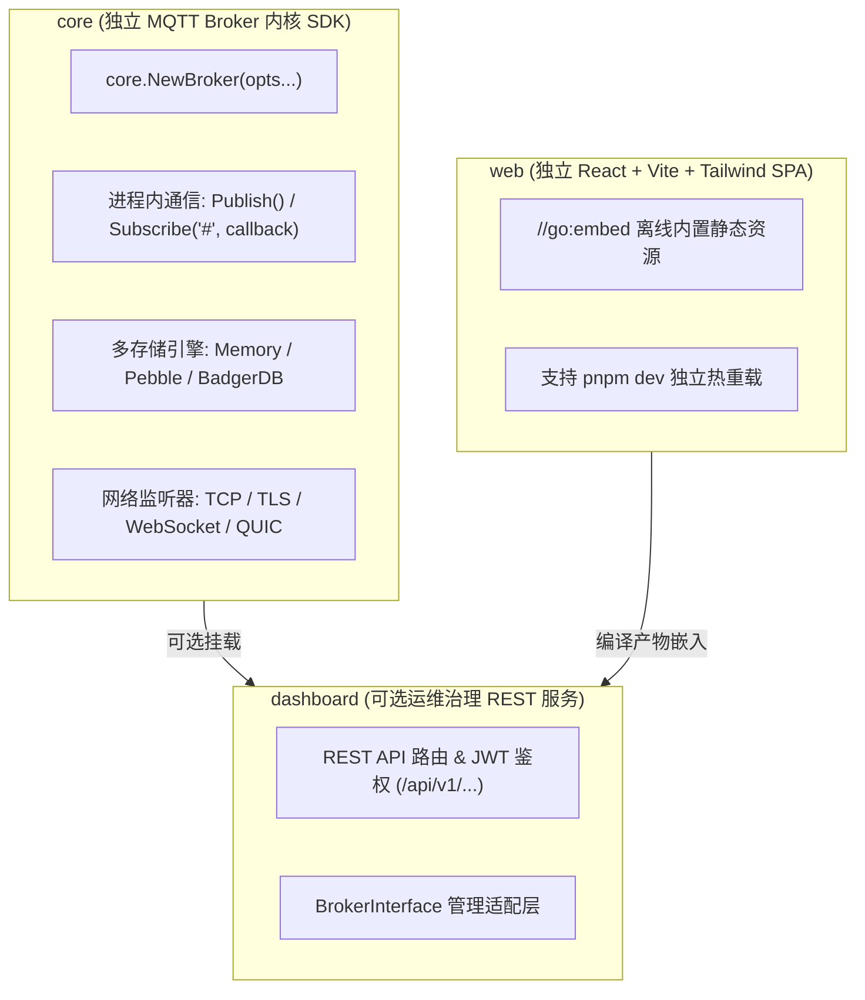

# AirMQ: 极速轻量纯 Go 工业级分布式 MQTT Broker

[](LICENSE)
[](go.mod)
[](scripts/run_all_tests.ps1)
[](examples/05_iot_scenarios_bench)
[](.agents/skills/mqtt-core/SKILL.md)

**AirMQ** 是基于社区成熟 Reactor 网络引擎（`gnet/v2`，支持 Linux epoll / Windows IOCP）研发的高性能分布式工业级 MQTT 消息代理服务器。具备极致的单机路由匹配与流式推流性能，完整支持 **MQTT 3.1.1** 与 **MQTT 5.0** 协议标准，提供插件化扩展（Kafka、HTTP Auth）以及多存储引擎热插拔（Memory / Pebble / BadgerDB）。

---

## 🚀 核心架构与技术创新

* **极致主题路由匹配（ART + Lock-Free COW）**：自适应基数树 + Token Interning 字典压缩 + 读写无锁 Fast-Path，实测达到 **9,600 万次匹配/秒 (12.18ns/op, 0 堆分配)**。
* **Zero-Alloc 裸流线缆旁路推流**：针对高吞吐 QoS 0 遥测消息，直接通过网络字节流裸分发，跳过结构体构建与二次序列化，单机推流速率冲刺突破 **560,000 msg/s**，高并发持续压测 **0.0000% 消息丢失**。
* **纯 Go 多引擎可配置持久化**：
  * **Pebble (推荐默认)**：CockroachDB 顶级自研 LSM-Tree，免 CGO，自动压实回收，无磁盘膨胀烦恼。
  * **BadgerDB**：基于 WiscKey 键值分离 LSM-Tree，后台自动定时执行 ValueLog GC。
  * **Memory**：极速纯内存存储，适合边缘设备或无持久化要求的超低延迟网关。
* **MQTT 3.1.1 & 5.0 完整支持**：QoS 0/1/2 严格 4 步握手 (Exactly-Once)、LWT 遗嘱消息、26 种强类型属性 (Properties TLV)、40+ 种 Reason Codes、NoLocal、RetainHandling、服务端自动分配 ClientID、增强型认证 (AUTH)。
* **下一代 MQTT over QUIC (UDP 传输支持)**：标杆 EMQX 5.0 旗舰架构，支持 RFC 9000 QUIC 传输层协议；具备 **0-RTT 极速握手**、**多路复用无队头阻塞**、以及在 4G/5G/Wi-Fi 网络漫游时 **连接无感迁移 (Connection Migration)**，弱网环境下掉线重连零等待；网络协议层与核心 Broker 引擎彻底解耦，后续接入新网络协议（如 MQTT-SN/CoAP）零修改核心引擎。
* **分布式网状集群 (P2P Cluster Mesh)**：私有高效二进制 RPC，按需动态广播路由订阅变更，单份报文跨节点直达目标 Broker。
* **插件扩展体系 (Hook Pipeline)**：支持高并发本地 TTL 缓存的 HTTP Auth 鉴权插件，以及基于环形队列批量 Flush 的 Kafka 遥测转发桥接器。

---

## 📦 架构分层与核心依赖库 (Core SDK)

本项目严格分为三层解耦架构，支持将 Broker 内核直接作为 Go 依赖嵌入至外部微服务中：



* **`core`**：核心 MQTT Broker 引擎与 SDK。微服务或边缘应用无需运行 Dashboard 即可直接在 Go 源码中 `import "mqtt/core"` 实例化启动 Broker，并利用 `broker.Subscribe("#", handler)` 订阅全量消息；
* **`dashboard`**：看板服务后端，实现 RESTful 管理接口（JWT 鉴权、指标统计、规则引擎与连接器管理），通过标准 `BrokerInterface` 挂载至 `core.Broker`；
* **`web`**：现代化企业级 Web 前端，基于 React 18 + Vite + Tailwind CSS，既可独立热更新开发，也可静态内嵌编译。

### 嵌入式开发示例 (直接引入 core)

```go
package main

import (
	"context"
	"log"
	"time"

	"mqtt/core"
)

func main() {
	// 1. 初始化纯净的 Broker（无需启动看板服务）
	broker, err := core.NewBroker(
		core.WithTCP(":1883"),
		core.WithMemoryStore(), // 或 core.WithPebbleStore("./data")
		core.WithMulticore(true),
	)
	if err != nil {
		log.Fatalf("初始化 Broker 失败: %v", err)
	}

	// 2. 业务服务直接订阅全量 MQTT 消息 (支持 # / + 通配符)
	unsub, err := broker.Subscribe("#", 0, func(topic string, payload []byte) {
		log.Printf("[业务服务收到消息] 主题: %s, 数据: %s", topic, string(payload))
	})
	if err != nil {
		log.Fatalf("订阅失败: %v", err)
	}
	defer unsub()

	// 3. 在后台启动网络监听
	go func() {
		if err := broker.Start(); err != nil {
			log.Fatalf("Broker 运行异常: %v", err)
		}
	}()

	// 4. 业务服务可直接向 Broker 进程内极速发布消息
	_ = broker.Publish("control/commands", []byte(`{"action":"sync"}`), 0, false)

	time.Sleep(10 * time.Second)
	_ = broker.Stop(context.Background())
}
```

---

## 🛠️ 快速上手

### 1. 编译构建
```bash
# Windows PowerShell
$env:CGO_ENABLED="0"; go build -o broker.exe ./cmd/broker

# Linux / macOS
CGO_ENABLED=0 go build -o broker ./cmd/broker
```

### 2. 启动 Broker（可自由配置存储引擎）

#### 模式 A：生产推荐 —— Pebble LSM-Tree 持久化存储
```powershell
.\broker.exe -addr "tcp://0.0.0.0:1883" -store=pebble -pebble-dir="./pebble_data" -multicore=true
```

#### 模式 B：纯内存极速模式（零磁盘 I/O）
```powershell
.\broker.exe -addr "tcp://0.0.0.0:1883" -store=memory -multicore=true
```

#### 模式 C：BadgerDB 键值分离持久化存储
```powershell
.\broker.exe -addr "tcp://0.0.0.0:1883" -store=badger -badger-dir="./badger_data"
```

### 3. 安全加密与多元传输接入 (TLS / mTLS / WebSocket)

#### 模式 D：TLS 1.2/1.3 传输加密与 mTLS 客户端双向认证 (8883)
```powershell
# 启用 TLS 传输加密
.\broker.exe -addr "tcp://0.0.0.0:1883" `
             -tls-addr=":8883" `
             -tls-cert="./certs/server.crt" `
             -tls-key="./certs/server.key"

# 启用 mTLS 双向证书认证（硬件网关设备一机一密免密鉴权）
.\broker.exe -addr "tcp://0.0.0.0:1883" `
             -tls-addr=":8883" `
             -tls-cert="./certs/server.crt" `
             -tls-key="./certs/server.key" `
             -tls-ca="./certs/ca.crt" `
             -tls-verify-client=true
```

#### 模式 E：MQTT over WebSocket (8083) 网页端与小程序接入
```powershell
# 启动 WebSocket 监听（默认路径 /mqtt）
.\broker.exe -addr "tcp://0.0.0.0:1883" `
             -ws-addr=":8083" `
             -ws-path="/mqtt"
```

#### 模式 F：MQTT over QUIC (基于 UDP :14567 极速接入与连接迁移)
```powershell
# 启用 MQTT over QUIC 监听 (UDP 默认 14567 端口，未配置证书时自动生成 TLS 1.3 临时证书即开即测)
.\broker.exe -addr "tcp://0.0.0.0:1883" `
             -quic-enable=true `
             -quic-addr=":14567"

# 生产环境配置受信任的 TLS 1.3 证书
.\broker.exe -addr "tcp://0.0.0.0:1883" `
             -quic-enable=true `
             -quic-addr=":14567" `
             -quic-cert="./certs/quic_server.crt" `
             -quic-key="./certs/quic_server.key"
```

### 4. 去中心化集群自发现 (PEX 种子对等自组网)

无需事先知道所有节点地址，只需指定任意 1 个种子地址，集群自动完成全网拓扑自愈收敛 (Full-Mesh)：

**种子节点 1 (Node-1)**：
```powershell
.\broker.exe -addr "tcp://0.0.0.0:1883" `
             -cluster-node="node-1" `
             -cluster-listen="127.0.0.1:19991"
```

**节点 2 (Node-2，指定 Node-1 为种子)**：
```powershell
.\broker.exe -addr "tcp://0.0.0.0:1884" `
             -cluster-node="node-2" `
             -cluster-listen="127.0.0.1:19992" `
             -cluster-seeds="127.0.0.1:19991"
```

**节点 3 (Node-3，弹性扩容仅指向 Node-2)**：
```powershell
# Node-3 会自动通过 Node-2 自发现 Node-1，并在后台秒级完成与 Node-1 直连！
.\broker.exe -addr "tcp://0.0.0.0:1885" `
             -cluster-node="node-3" `
             -cluster-listen="127.0.0.1:19993" `
             -cluster-seeds="127.0.0.1:19992"
```

* **本地一键验证**：运行 `.\scripts\test_cluster_discovery.ps1`，可在本地单机一键拉起 3 节点进程，全自动验证自组网、跨节点分发与容灾下线。


### 5. Prometheus 监控大盘与令牌桶限流防刷

```powershell
# 启动 Broker 并开启 Prometheus 监控端点及连接/发布限流削峰
.\broker.exe -addr "tcp://0.0.0.0:1883" `
             -metrics-addr=":8080" `
             -rate-limit-conn=1000 -rate-limit-conn-burst=2000 `
             -rate-limit-pub=500 -rate-limit-pub-burst=1000
```
* **监控抓取地址**：`http://localhost:8080/metrics`（或直接复用 WebSocket 端口 `http://localhost:8083/metrics`）
* **核心指标一览**：`mqtt_connections_active`、`mqtt_messages_received_total`、`mqtt_messages_sent_total`、`mqtt_rate_limit_dropped_total`、`mqtt_cluster_nodes_online`。

### 6. 工业级 Kafka / 时序数据库流式投递管道 (带磁盘 RingBuffer 削峰)

解决下游消息队列/时序库在网络抖动、维护下线或并发写入瓶颈时的消息积压难题，实现**既保证不拖慢 MQTT 网关性能，又最大程度防止下游投递丢失**：

```powershell
# 启用工业级流式管道，批量高效投递至 Kafka（带 16MB 预分配段文件与 5GB 磁盘备选削峰）
.\broker.exe -addr "tcp://0.0.0.0:1883" `
             -pipeline-enable=true `
             -pipeline-sink="kafka" `
             -pipeline-kafka-brokers="127.0.0.1:9092" `
             -pipeline-topic="iot_telemetry" `
             -pipeline-spool-dir="./pipeline_spool" `
             -pipeline-batch-size=1000 `
             -pipeline-flush-ms=20 `
             -pipeline-spool-max-gb=5
```

* **L1 + L2 两级削峰架构**：
  * **L1 内存缓冲 (Sharded RingBuffer)**：CPU Cache-Line 64 字节对齐补齐（Padding），杜绝 12 核以上并发伪共享（False Sharing）；快速入队仅需 **~20ns，0 堆分配**，MQTT EventLoop 线程绝不阻塞于磁盘或网络。
  * **L2 磁盘备选 (Segmented Disk Spooler)**：当下游后端宕机或网络中断时，熔断器自动跳闸，后台专属 Worker 将消息批打包并在单次文件系统调用（`file.WriteAt`）中写入预分配好的 16MB 段文件，消除 OS 元数据锁争用。
  * **有界磁盘配额与自愈恢复**：严格限制最大磁盘使用（默认 5GB），避免打满磁盘导致宕机；后端恢复后熔断器自动探测，优先从磁盘批量读回并顺畅回放，重放后自动回收旧段文件。
  * **插件式驱动注册表**：通过标准 `pipeline.Sink` 接口实现驱动即插即用，原生支持 Kafka、Stdout、Mock，并可快速扩展至 Pulsar、RabbitMQ、TDengine 或 InfluxDB。

### 7. 现代化运维治理可视化控制台 (Web Dashboard)

标杆 **EMQX 5.0 Dashboard** 工业设计，内置现代化企业级 Web 管理控制台。前端基于 React 18 + TypeScript + Vite + Tailwind CSS 企业级组件库打造，通过 Go 1.16+ `//go:embed` 完整内嵌至单一 `broker.exe` 可执行文件中，**零外部 CDN 依赖，支持工业局域网/隔离网络完全离线运行**。

```powershell
# 启动 Broker（Web Dashboard 默认已开启，监听 :18083）
.\broker.exe -addr "tcp://0.0.0.0:1883"

# 自定义 Dashboard 端口与超级管理员凭据（默认 admin / public）
.\broker.exe -addr "tcp://0.0.0.0:1883" `
             -dashboard-enable=true `
             -dashboard-addr=":18083" `
             -dashboard-user="admin" `
             -dashboard-password="your_strong_password"

# 前端开发调试模式（指定本地静态目录热重载，无需每次重新打包 Go 二进制）
.\broker.exe -dashboard-web-dir="./web/dist"
```

* **访问地址**：`http://localhost:18083`
* **默认凭据**：用户名 `admin` / 密码 `public`
* **八大核心治理功能模块**：
  1. **监控大盘 (Overview)**：实时展现 CPU、Goroutine、内存分配、四大网络协议连接数 (TCP, TLS, WS, QUIC)、60FPS 双曲线实时流向 QPS 动图。
  2. **客户端治理 (Clients)**：全量客户端在线列表、分页检索/模糊搜索、协议与网络传输类型识别、活跃订阅抽屉面板、一键断开物理连接 (Kick)。
  3. **订阅关系管理 (Subscriptions)**：全局订阅关系树状列表、按通配符主题检索、管理员强制注销订阅。
  4. **保留消息管理 (Retained)**：查看全量 Retained 消息、QoS、数据包大小及 Payload 文本预览，支持一键删除。
  5. **监听器监控 (Listeners)**：TCP (:1883)、TLS (:8883)、WS (:8083)、QUIC (:14567) 运行状态与连接负载监控。
  6. **集群拓扑 (Cluster Mesh)**：动态拓扑全览、PEX 种子自发现节点状态、SWIM 三态健康监控与心跳时序。
  7. **规则与数据集成 (Rules & Integration)**：解耦多 MQ 驱动架构（首发支持 Kafka，可插拔扩展 RabbitMQ/Pulsar），无锁预编译纳秒级过滤（5~10ns, 0 分配），端到端设备 ClientID 保序，在线配置热生效，毫秒级 Ping 连通性测试，两级削峰缓冲与配置持久化。
  8. **在线消息调试工具 (MQTT Publish Tool)**：免客户端在线调试器，支持指定 Topic、QoS (0/1/2)、Retain 标识及 Payload 内容实时下发。
* **企业级用户体验**：
  * **国际化多语言 (i18n)**：简体中文 (zh-CN) / English (en-US) 一键即时切换与持久化记录；
  * **工业暗黑主题**：EMQX 绿 (`#10b981`) 与暗黑微光底色，全套 Lucide 矢量图标；
  * **只读快照安全保证**：所有数据查询均使用只读快照机制，与高并发推流 Fast-Path 严格物理隔离，**对 8.6ns 核心路由推流零性能损耗**。

### 8. 统一自洽管道与处理器架构 (Self-Contained Processor Pipeline)

提供纯正 Idiomatic Go 范式的管道引擎，解耦所有业务处理，核心具备三大特征：
- **职责自洽契约 (`Processor`)**：每个处理器仅需实现 2 个方法：`Match(c *Context) bool`（自主预判是否处理当前报文）与 `Process(c *Context) error`（执行具体业务处理），底层不掺杂任何特定业务逻辑；
- **内置性能监控与测速**：框架自动在纳秒级探针中记录调用量、匹配数、跳过数、拦截丢弃数、平均耗时与峰值耗时，支持调用 `pipe.PrintStats()` 直接输出可视化实时性能表格；
- **全链路 0 堆分配 (0 allocs/op)**：单机支持数百万级高频并发，未挂载管道主题原子穿透仅需 **1.09ns**。

#### 真实物联网业务场景性能基准 (实测数据)

运行完整物联网业务压测套件：`go run ./examples/05_iot_scenarios_bench/main.go`

| 真实业务场景 | 业务规则 | 混合吞吐量 (QPS) | 管道执行耗时 | 拦截丢弃率 |
| :--- | :--- | :--- | :--- | :--- |
| **场景 1: 智能表计** (简单) | ClientID 格式认证 + 0 字节空包/心跳过滤 | **6,274,312 msg/s** (627万) | P50 < 100ns, P99 < 5µs | 过滤 5% 脏包/扫描 |
| **场景 2: 工业制造** (一般) | 网关鉴权 + JSON 格式校验 + 微秒时间戳增强 + Kafka 写入 | **2,009,619 msg/s** (201万) | P50 < 500ns, P99 < 15µs | 拦截 10% 损坏JSON |
| **场景 3: 车联网 V2X** (复杂) | VIN 码鉴权 + CAN 二进制 TLV 魔数校验 + 碰撞告警紧急分流 + GPS 隐私脱敏 | **2,810,014 msg/s** (281万) | P50 < 500ns, P99 < 18µs | 智能自洽跳过 90% 无关流 |

### 9. AI-Native Skill 与使用文档融合体系 (Skill & Docs Fusion)

为适应新一代 AI 辅助研发（AI-Assisted Pair Programming）与 Agent 协同开发，本项目首创 **AI Skill 与人类使用手册深度融合** 的组织范式，直接归档于 [`.agents/skills/mqtt-core/`](.agents/skills/mqtt-core/) 目录：

* 🤖 **[MQTT Core 开发者与 AI 协同实战指南 (SKILL.md)](.agents/skills/mqtt-core/SKILL.md)**：包含核心心智模型、4 大极速开箱实战配方、避坑反模式，AI Agent 可直接自动激活遵循；
* 📖 **[API 完整规范与配置速查 (api_reference.md)](.agents/skills/mqtt-core/references/api_reference.md)**：覆盖 Broker、Pipe、Context、Message、多格式 Validator 的所有公共导出函数与 Options 参数详解；
* 💡 **[物联网高频业务处理器设计范式 (processor_patterns.md)](.agents/skills/mqtt-core/references/processor_patterns.md)**：汇聚多租户认证、车载二进制 TLV、边缘数据增强、双通道 Kafka、告警防抖 5 大工业级经典场景。

---

## 🧪 自动化测试与大版本全量回归

项目配备工业级统一自动化回归测试流水线，一键执行**静态构建检查**、**核心组件单元测试**、**21 项协议一致性与传输加密测试**以及**200,000 msg/s 高吞吐防丢压测**：

```powershell
# Windows 环境运行全量回归
.\scripts\run_all_tests.ps1

# 快速自测模式 (跳过压测，3 秒内完成)
.\scripts\run_all_tests.ps1 -SkipBench
```

```bash
# Linux / macOS / CI 环境运行全量回归
./scripts/run_all_tests.sh
```

---

## 📚 详细设计与演进路线

* [MQTT Core 开发者与 AI 协同实战指南 (AI-Native Skill)](.agents/skills/mqtt-core/SKILL.md)
* [系统审查报告与演进路线图 (Architecture Audit & Roadmap)](docs/architecture_audit_and_roadmap.md)
* [百万连接与高吞吐压测调优指南](scripts/README.md)
