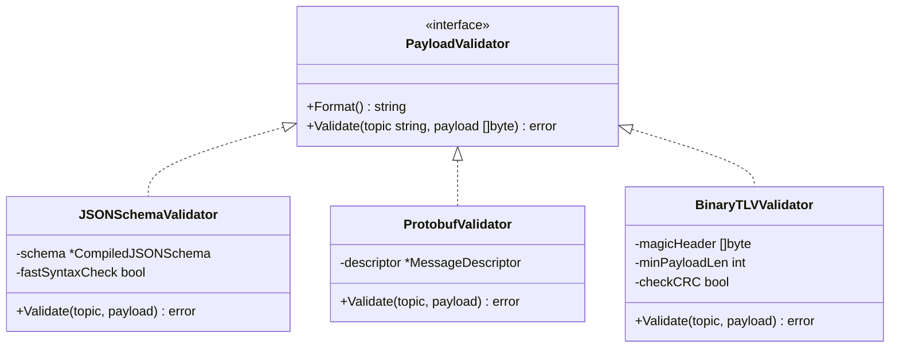
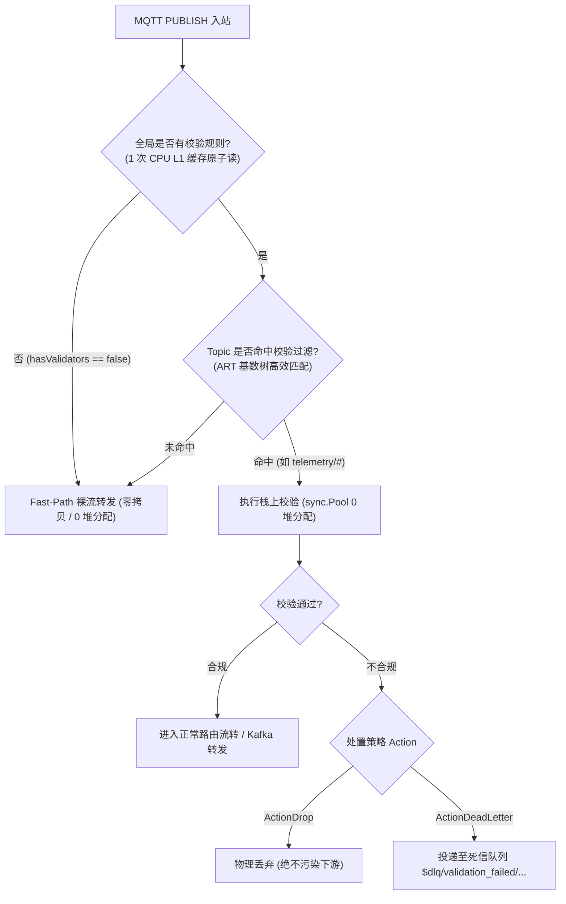

# MQTT 消息数据与格式校验架构设计文档 (Schema Validation Design)

本文档定义了 MQTT Broker 核心引擎中的**数据与格式校验器 (Schema Validator)** 架构设计规范与实现路线图，重点解决工业物联网场景下的多格式支持、高性能低延迟约束与统一管道编排。

---

## 一、 行业技术背景与格式选型分析

在物联网与工业数据采集中，MQTT 传输的 Payload 在网络底层统一为不可见的二进制字节流（`[]byte`）。但在业务应用层，数据呈现出明显的**分层分化**特征：

| 数据格式标准 | 行业占比与定位 | 核心优势 | 劣势与挑战 | 典型场景与厂商实现 |
| :--- | :--- | :--- | :--- | :--- |
| **JSON Schema** *(Draft-07 / 2020-12)* | **绝对主流 (75%+)** 应用层与半结构化事实标准 | 极高的人机可读性、声明式强表达能力（字段必填、正则、数值区间、枚举）、云原生与微服务生态通用 | 文本体积相对较大，复杂嵌套 Schema 校验 CPU 消耗高 | **EMQX 5.0 Schema Registry**、阿里云 IoT 物模型、AWS IoT Core、ThingsBoard |
| **Google Protobuf** *(Protocol Buffers)* | **次主流 (15~20%)** 高吞吐/窄带二进制标准 | 极端紧凑的二进制压缩比、微秒级序列化/反序列化性能、强类型契约 | 依赖编译期 `.proto` 文件，不可直接阅读，在线热更新与动态演进成本高 | 车联网 TSP 底层通道、4G/5G Cat.1 边缘网关、金融级高频行情 |
| **Custom Binary / TLV** *(Tag-Length-Value)* | **工业私有协议 (5~10%)** 传统 PLC/传感器总线 | 内存直接对齐、无需任何动态分配、极低功耗 MCU 友好 | 缺乏通用标准，每个设备厂商私有定义 | 电力规约 (104规约)、Modbus RTU over MQTT、水文水利国标报文 |
| **Apache Avro** | **特定流式场景 (<5%)** 大数据湖仓标准 | 专为数据流转优化，Schema 集中注册管理 | 边缘端嵌入式 C/Go SDK 较重，不适合端侧设备 | Confluent Kafka Schema Registry、数据湖实时入仓 |

**结论**：校验器架构设计**必须以 JSON Schema 为第一核心**，同时在接口抽象上**完整兼顾 Protobuf 与自定义二进制 TLV 格式**。

---

## 二、 核心架构：多格式校验抽象

校验器在架构上不能仅局限于 JSON 文本，而是抽象为通用的 **`PayloadValidator`** 契约接口：

### 1. JSON Schema 校验器 (轻量内置 + 开放扩展)
- **极速轻量校验 (内置)**：
  1. `json.Valid` 快速语法校验；
  2. 必填顶层字段检查（`RequiredFields: ["device_id", "ts"]`）；
  3. 字段类型与物理量数值区间（如 `temperature` 限制在 `[-50, 120]`，超出判为异常离群脏数据）。
- **完整 Draft-07 / 2020-12 校验 (开放挂载)**：
  提供标准闭包挂载能力，允许业务按需引入成熟高性能引擎（如 `santhosh-tekuri/jsonschema`），核心库保持 0 沉重依赖。

### 2. Protobuf 二进制校验器
- 校验数据体是否满足指定 Proto 的 Wire-Format 规范；
- 避免因设备端固件版本不一致导致的下游反序列化 Panic。

### 3. Binary / TLV 工业报文校验器
- 固定魔数报头检查（如 `0xAA 0x55`）；
- 报文最小长度校验；
- 末尾硬件 CRC16 / CRC32 校验码比对。

---

## 三、 性能第一要素：零旁路开销准则

格式校验是高频 CPU 密集操作，必须恪守以下性能准则，确保引入校验后**不劣化现有网络 Fast-Path 性能**：

1. **零旁路开销 (Zero-Bypass Fast-Path)**：
   未配置校验的主题或全局未开启校验时，仅消耗 1 次 CPU L1 缓存的原子布尔判断（`< 1ns`），直接原路进入已有的 560,000 msg/s 裸流通道；
2. **栈上连续执行，杜绝 Channel / Goroutine 切换**：
   校验在当前事件处理函数栈上以连续纯函数方式执行，杜绝调度延迟与锁竞争；
3. **零堆分配 (`0 allocs/op`)**：
   校验上下文采用 `sync.Pool` 对象池复用，杜绝频繁创建临时结构体引发 GC Stop-The-World。

---

## 四、 处置策略与死信告警机制 (Action Policies)

标杆 EMQX 5.0，校验失败时支持两种处置动作：

1. **`ActionDrop` (物理丢弃，默认)**：
   在入口处直接丢弃报文，绝不进入主题树广播、不写入 Retained 存储、不投递给外部 MQ 桥接，彻底阻断脏数据污染下游；
2. **`ActionDeadLetter` (死信队列 / 告警审计)**：
   拦截原消息的同时，将 `{original_topic, client_id, reason, raw_payload, timestamp}` 格式化为告警结构，自动路由至 `$dlq/validation_failed/{topic}`，供运维或数据治理系统订阅审计。

---

## 五、 落地与工程交付

1. **统一管道底层 (`pkg/pipeline`)**：以标准 Idiomatic Go 函数切片与洋葱圈模型 (`type Handler func(c *Context) error`) 构建高性能统一管道底座，与业务完全解耦；
2. **多格式校验器落地**：提供开箱即用的 `RawValidator`、`BinaryValidator`（支持魔数与 TLV 帧校验）和 `JSONValidator`，通过标准中间件 `pipeline.Validate(v)` 无缝插入管道；
3. **零分配与极速旁路**：未配置管道的主题原子旁路耗时 `< 1.2ns`，管道热路径通过 `sync.Pool` 达成 `0 allocs/op`。
